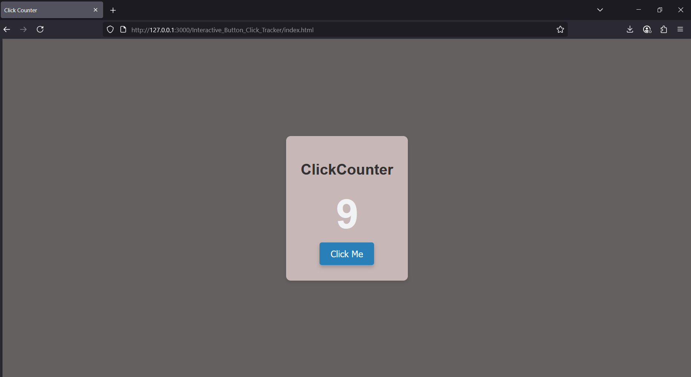

# Interactive_Button_Click_Tracker
## Date: 12-07-2025
## Objective:
To implement a counter using JavaScript closures and demonstrate how variables maintain their state across function calls, emphasizing the concepts of function scope and lexical closures.

## Tasks:

#### 1. Structure the HTML Layout:
Create a simple interface with:

A heading like ```<h1>ClickCounter</h1>```

A ```<button>``` labeled “Click Me”

A ```<p> or <div>``` to display the number of clicks

#### 2. Style with CSS:
Center the layout and apply padding and background color

Use large fonts for the click display

Add hover effects on the button

#### 3. Write JavaScript with Closure:
Create a function createCounter() that returns another function

The inner function should increment and return a count variable stored in the outer function’s scope

Use this closure to track how many times the button has been clicked

Update the DOM each time the button is clicked using the closure function
## HTML Code:
```html
<!DOCTYPE html>
<html lang="en">
<head>
    <meta charset="UTF-8">
    <meta name="viewport" content="width=device-width, initial-scale=1.0">
    <title>Click Counter</title>
    <link rel="stylesheet" href="styles.css">
</head>
<body>
    <div class="container">
        <h1>ClickCounter</h1>
        <div id="display">0</div>
        <button id="clickBtn">Click Me</button>
    </div>
    <script src="scripts.js"></script>
</body>
</html>
```
## CSS Code:
```css
body {
    font-family: Arial, sans-serif;
    background-color: #646060;
    margin: 0;
    padding: 0;
    display: flex;
    justify-content: center;
    align-items: center;
    min-height: 100vh;
}

.container {
    text-align: center;
    background-color: rgb(200, 183, 183);
    padding: 2rem;
    border-radius: 10px;
    box-shadow: 0 4px 8px rgba(0, 0, 0, 0.1);
  
}

h1 {
    color: #333;
    margin-bottom: 2rem;
}

#display {
    font-size: 5rem;
    font-weight: bold;
    color: #f0f2f4;
    margin: 1rem 0;
}

button {
    background-color: #3498db;
    color: white;
    border: none;
    padding: 0.8rem 1.5rem;
    font-size: 1.2rem;
    border-radius: 5px;
    cursor: pointer;
    transition: all 0.3s ease;
}

button:hover {
    background-color: #2980b9;
    transform: translateY(-2px);
    box-shadow: 0 4px 8px rgba(0, 0, 0, 0.2);
}
```
## JavaScript Code:
```js
function createCounter() {
    let count = 0; 
    
    return function() {
        count += 1;
        return count;
    }
}


const counter = createCounter();


const clickBtn = document.getElementById('clickBtn');
const display = document.getElementById('display');


clickBtn.addEventListener('click', () => {
    const currentCount = counter();
    display.textContent = currentCount;
    display.style.transform = 'scale(1.1)';
    setTimeout(() => {
        display.style.transform = 'scale(1)';
    }, 200);
});
```
## Output:


## Result:
A mini module using JavaScript closure and scope is successfully implemented to build an interactive button click tracker that updates in real time without exposing internal variables.
